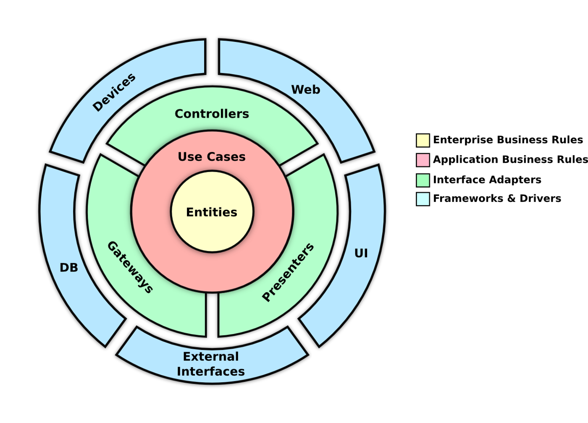

<h1 align="center">
	<p></p>
API trung tâm tin học Sao Việt
</h1>

<p align="center">Dự án xây dựng API mã nguồn mở trên nền tảng .NET Core 7, sử dụng <b>Clean architecture</b> và <b>Repository pattern</b></p>

<p align="center">
	
	
	
	<a href="https://opensource.org/licenses/MIT"></a>
</p>

# Mục lục

- [Mục lục](#mục-lục)
- [Tổng quan](#tổng-quan)
  - [Giới thiệu](#giới-thiệu)
  - [Chi tiết](#chi-tiết)
  - [Kiến trúc](#kiến-trúc)
  - [Repository pattern](#repository-pattern)
  - [Môi trường phát triển](#môi-trường-phát-triển)
- [Cài đặt](#cài-đặt)
  - [Cài đặt môi trường phát triển](#cài-đặt-môi-trường-phát-triển)
  - [Cài đặt Log và Monitor](#cài-đặt-log-và-monitor)
  - [Cấu hình kết nối với SQL Server](#cấu-hình-kết-nối-với-sql-server)
- [Tài liệu](#tài-liệu)
- [Người đóng góp](#người-đóng-góp)
- [Liên hệ](#liên-hệ)
- [Giấy phép](#giấy-phép)

# Tổng quan

## Giới thiệu

Sao Việt API là một công cụ tạo dữ liệu tự động cho các ứng dụng phần mềm. Nó cung cấp dữ liệu về giáo viên, lớp học, học sinh... Sử dụng Sao Việt API giúp cho việc lấy dữ liệu trở nên dễ dàng và nhanh chóng.

## Chi tiết

Các thành phần chính của API bao gồm:

- **Quản lý dữ liệu:** Là một dự án .NET Core 7, sử dụng Entity Framework Core để quản lý dữ liệu. Dữ liệu được lưu trữ trong cơ sở dữ liệu SQL Server.
- **Loggging:** Sử dụng trình quản lý ghi nhật ký Elastic Stack để quản lý nhật ký.
- **Giám sát:** Sử dụng trình quản lý giám sát Prometheus và Grafana để giám sát tình trạng của API.
- **Cache:** Sử dụng memory cached để lưu trữ dữ liệu cache.
- **Giao diện người dùng:** Sử dụng Swagger để triển khai giao diện người dùng.

## Kiến trúc

API được thiết kế theo kiến trúc Clean architecture. Các thành phần chính của kiến trúc bao gồm:

<p align="center"></p>

- **Domain:** Là các đối tượng thể hiện các bảng trong cơ sở dữ liệu.
- **Application:** Là các lớp xử lý nghiệp vụ của API.
- **Infrastructure:** Là các lớp cung cấp các dịch vụ như cơ sở dữ liệu, giao diện người dùng, nhật ký, giám sát, cache...
- **WebApi:** Là các lớp cung cấp các API cho người dùng.

## Repository pattern

API sử dụng mô hình Repository pattern để truy xuất dữ liệu. Mô hình này bao gồm các thành phần sau:

<p align="center"></p>

- **Interface:** Là một interface chứa các phương thức truy xuất dữ liệu.
- **Repository:** Là một lớp thực thi interface.
- **Service:** Là một lớp chứa các phương thức xử lý nghiệp vụ.

## Môi trường phát triển

Để phát triển API, bạn cần cài đặt các thành phần sau:

- .NET Core 7
- SQL Server 2022
- ELK Stack
- Prometheus
- Grafana

# Cài đặt

## Cài đặt môi trường phát triển

Để cài đặt môi trường cho việc phát triển API, bạn cần cài đặt các thành phần sau:

- [.NET Core 7](https://dotnet.microsoft.com/download/dotnet-core/7.0)
- [SQL Server](https://www.microsoft.com/en-us/sql-server/sql-server-downloads)
- [Docker](https://www.docker.com/products/docker-desktop)

> 🐳 Ngoài ra có thể triển khai môi trường một cách nhanh chóng bằng cách sử dụng [Docker](https://docs.docker.com/).
>
> Đầu tiên, bạn cần pull image .NET 7 từ Docker Hub:
>
> ```bash
> docker pull mcr.microsoft.com/dotnet/core/sdk:7.0
> ```
>
> Khởi động container .NET 7:
>
> ```bash
> docker run -it --name dotnet7_container -p 8080:80 microsoft/dotnet:7.0-runtime
> ```
>
> Cài đặt SQL Server:
>
> ```bash
> docker pull mcr.microsoft.com/mssql/server
> ```
>
> Khởi động container SQL Server:
>
> ```bash
> docker run -e 'ACCEPT_EULA=Y' -e 'SA_PASSWORD=yourStrong(!)Password' -p 1433:1433 -d mcr.microsoft.com/mssql/server
> ```
>
> Ngoài ra, bạn cũng có thể sử dụng [Docker Compose](https://docs.docker.com/compose/) để khởi động môi trường phát triển.

Cuối cùng, bạn cần khởi động API bằng cách chạy lệnh sau:

```bash
dotnet run
```

> 📝 Lưu ý: Nếu bạn sử dụng Docker, bạn cần chạy lệnh sau để khởi động API:
>
> ```bash
> docker run -it --name dotnet7_container -p 8080:80 -v /path/to/project:/app microsoft/dotnet:7.0-runtime
> ```

## Cài đặt Log và Monitor

Sau đó, bạn cần thiết lập các thành phần như Elastic Stack, Prometheus và Grafana. Để làm được điều này, bạn cần chạy lệnh sau:

```bash
docker-compose up -d
```

Để sử dụng được các thành phần này, vui lòng tham khảo tạo trang [Wiki](https://github.com/foxminchan/SaoVietAPI/wiki).

## Cấu hình kết nối với SQL Server

Sau khi khởi động API, bạn có thể truy cập vào giao diện người dùng của API tại địa chỉ `http://localhost:(port)/swagger`. Với port được thiết lập trong file `appsettings.json`.

Sau đó tiến hành cấu hình kết nối với SQL Server.

Đầu tiên thay đổi chuỗi kết nối trong file [`appsettings.json`](./WebAPI/WebAPI/appsettings.json)

```json
"ConnectionStrings": {
    "DefaultConnection": "Data Source=your_server;Initial Catalog=your_database;User ID=your_username;Password=your_password; Integrated Security=True; TrustServerCertificate=True"
}
```

Xoá các Migration cũ:

```bash
dotnet ef migrations remove
```

Tạo Migration mới:

```bash
dotnet ef migrations add InitialCreate
```

`Lưu ý:` Cơ sở dữ liệu cần được tạo trước khi chạy lệnh này.

Cuối cùng, cập nhật cơ sở dữ liệu:

```bash
dotnet ef database update
```

# Tài liệu

- Xem Các thay đổi tại trang [Changelog](./CHANGELOG.md)
- Xem tài liệu về cách sử dụng API tại trang [API Documentation](#)
- Xem quy tắc ứng xử tại trang [Contributor Covenant Code of Conduct](./CODE_OF_CONDUCT.md)
- Xem đóng góp tại trang [Contributing](./CONTRIBUTING.md)
- Xem chính sách bảo mật tại trang [Privacy Policy](./SECURITY.md)

# Người đóng góp

Sao Việt API là một dự án mã nguồn mở và được phát triển bởi các đóng góp của các thành viên sau:

<table align="center">
  <tbody>
	<tr>
		<td align="center"><a href="https://github.com/foxminchan"><br /><sub><b>Nguyễn Xuân Nhân</b></sub></a><br /><a href="https://github.com/foxminchan/SaoVietAPI/commits?author=foxminchan" title="Code">💻</a></td>
		<td align="center"><a href="https://github.com/lycaphe8x"><br /><sub><b>Nguyễn Đình Ánh</b></sub></a><br /><a href="#" title="Guide">📝</a></td>
	</tr>
  </tbody>
</table>

# Liên hệ

Nếu bạn có bất kỳ câu hỏi nào, vui lòng liên hệ với tôi qua các kênh sau:

- [Facebook](https://www.facebook.com/foxminchan)
- [Email](mailto:nguyenxuannhan407@gmail.com)

# Giấy phép

Sao Việt API được phát hành theo giấy phép [MIT](./LICENSE).

@Copyright (C) 2023 4FT. All rights reserved
